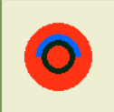

# 🏆 Checkers AI - Intelligent Game Player  

🔍 **Checkers AI** is a Python-based program that plays the game of **Checkers (Draughts)** as one of the players. The game is played on an **8×8 board** with **12 pieces per player**, following the standard checkers rules. The goal is to eliminate all opponent's pieces or block their possible moves.  

🤖 This project implements **AI-based decision-making**, using:  
- **Heuristic Evaluation** – Determines the best move based on piece positioning and game state.  
- **Variable Depth Search Engine** – Adjusts search depth dynamically for better performance.  
- **Minimax Algorithm** – Computes the best possible move considering all future possibilities.  
- **Alpha-Beta Pruning** – Optimizes Minimax by eliminating unnecessary calculations.  
- **Hash Map Optimization** – Reduces redundant computations and speeds up move selection.  

🎮 **Game Modes:**  
- **Standard Checkers Rules:** Pieces move diagonally and can jump over opponent pieces.  
- **Two Play Modes:** Choose whether capturing opponent pieces is **mandatory** or **optional**.  
- **King Promotion:** When a piece reaches the opponent's back row, it becomes a "king" and can move **both forward and backward**.  
- **Multi-Jump Sequences:** If a capture is possible, a piece can continue jumping over multiple opponent pieces in one turn.  
- **Console-Based Gameplay:** The game is played through the terminal, with a **graphical board representation** and move selection.  

⏳ **Performance:**  
- The AI must decide its move **within 5 seconds**.  
- For higher scores, the move must be computed in **less than 3 seconds**.  

---

📖 **This project was developed as part of the "Algorithms and Data Structures" course (2023/2024).**  

---

## 📚 Table of Contents  
- [🛠 Technologies & Specifications](#-technologies--specifications)  
- [🔧 Installing and Running the Project](#-installing-and-running-the-project)  
- [📖 How It Works](#-how-it-works)  
- [🤖 Game AI](#-game-ai)  
- [📜 License](#-license)  
- [📬 Contact](#-contact)

---

## 🛠 Technologies & Specifications  


### 📦 **Dependencies**  
The project relies on the following libraries and technologies:  

| Library      | Purpose |
|-------------|---------|
| `pygame`    | Used for rendering the game board and handling user interactions |
| `queue`     | Utilized for internal AI processing and state management |
| `time`      | Used for AI move timing and performance measurement |
| `json`      | Handles game configuration and move storage |
| `os`        | File system operations and handling saved games |

### 📥 **Install Dependencies**  
Before running the project, install the required dependencies using:  

```sh
pip install pygame
```

---

## 🔧 Installing and Running the Project  

### 📥 **1️⃣ Clone the Repository**  
First, download the project by cloning the repository:  

```sh
git clone https://github.com/MilanSazdov/checkers-ai.git
cd checkers-ai
```
### 📦 **2️⃣ Install Dependencies**  
Ensure you have all required dependencies installed:  

```sh
pip install pygame
```

### ▶️ **3️⃣ Run the Game**  
To start the checkers game, simply run the **board.py** script located inside the **checkers** folder:  

```sh
python checkers/board.py
```

---

## 📖 How It Works  

The **Checkers AI** game follows standard checkers rules, where players take turns moving pieces diagonally across the board. The AI calculates its best move using **Minimax with Alpha-Beta Pruning** and adjusts its **search depth dynamically** for performance optimization.  

### 🎮 **Game Interface**  
- The game starts with an **8×8 checkers board**, where black and red pieces are placed in their initial positions.  
- The AI's **thinking depth** is displayed in the top-left corner of the screen.  
- Pieces that **can be moved** are highlighted with a **yellow glowing effect**.  

🖼 **Game Start:**  
At the beginning of the game, the **depth is set to 3**, and all available pieces that can be moved are highlighted.  

  

---

### 🎯 **Selecting a Piece**  
- When a player selects a piece, it **turns green** to indicate the selection.  
- The possible **move positions** are displayed as **gray dots** on the board.  

🖼 **Piece Selection Example:**  

  

---

### 🔥 **Multi-Jump Capture**  
- If an opponent's piece can be captured, the game **forces a jump**.  
- The game supports **multi-jump captures**, allowing a piece to continue jumping as long as legal moves exist.  

🖼 **Multi-Jump in Action:**  

  

---

### 👑 **King Promotion**  
- When a piece reaches the opponent's **back row**, it gets **promoted to a king**.  
- Kings are visually distinct and can **move both forward and backward**.  

🖼 **King Pieces:**  

<p align="center">
    
    
</p>    

---

## 🤖 Game AI

The AI in this checkers game is built using **Minimax algorithm** with **Alpha-Beta pruning** for optimizing decision-making. Additionally, the engine supports **variable search depth**, **heuristic evaluation**, and a **hash map for board state caching** to improve performance.

---

### 🔍 **Minimax Algorithm**
The **Minimax** algorithm is used for making optimal decisions in a **two-player turn-based game**. The idea is to build a **game tree**, where each node represents a possible **board state**. The AI then evaluates these states recursively and picks the best possible move.

- The **Maximizing player** (AI) tries to **maximize** the score.
- The **Minimizing player** (human) tries to **minimize** the AI’s score.
- The algorithm explores all possible moves, evaluates them, and chooses the best one.

#### 🧩 **Algorithm Workflow:**
1. Generate all possible moves for the AI.
2. Simulate each move and generate a **game tree** up to a predefined **depth**.
3. Evaluate board positions using a **heuristic function**.
4. Use **Alpha-Beta pruning** to eliminate unnecessary computations.
5. Return the **best move** based on the computed scores.

---

### ⚡ **Alpha-Beta Pruning**
Since **Minimax** searches an exponential number of board states, we use **Alpha-Beta Pruning** to **skip** unpromising branches of the tree. This improves efficiency by eliminating unnecessary calculations.

- **Alpha (α)**: The **best score** that the maximizing player can guarantee.
- **Beta (β)**: The **best score** that the minimizing player can guarantee.
- If at any node, the **Maximizing Player** finds a move that is **better than Beta**, further evaluation stops.
- If at any node, the **Minimizing Player** finds a move that is **worse than Alpha**, further evaluation stops.

🚀 **This results in a significant speedup of the Minimax algorithm!**

---

### 📊 **Heuristic Evaluation Function**
Since checking all possible moves until the end of the game is computationally expensive, the AI evaluates board positions **before reaching the final state**. The **evaluation function** assigns a **numerical score** to each board state.

#### 🎯 **Factors Considered in the Evaluation Function:**
✔️ **Material Advantage**: Counts the number of normal pieces and kings.  
✔️ **Mobility**: Prioritizes positions where more pieces have possible moves.  
✔️ **Safety**: Figures that cannot be captured are favored.  
✔️ **Center Control**: Figures in the center of the board are prioritized.  
✔️ **Defense Strategy**: Figures in the last two rows are valued higher.  
✔️ **Promotion Potential**: More empty squares on the opponent’s promotion row increases the score.  
✔️ **Multiple Captures**: Moves leading to multiple jumps are highly favored.  

📌 **Final evaluation formula**:
\[
\text{Score} = 1.3(\text{safe pieces}) + 3.3(\text{safe kings}) + 1.15(\text{movable pieces}) + 3.15(\text{movable kings}) - 1.5(\text{loner pieces}) - 3.5(\text{loner kings}) + 1.35(\text{defensive pieces}) + 3.35(\text{defensive kings}) + 27.5(\text{captured pieces}) + 33.5(\text{captured kings}) + 1.25(\text{center-controlled pieces}) + 3.25(\text{center-controlled kings}) 
\]

🔢 **The AI aims to maximize this score for itself and minimize it for the opponent.**  

---

### 🔄 **Variable Search Depth**
The AI dynamically adjusts the **search depth** based on the game state:

- **Many pieces on the board** → Lower depth (faster decision-making)
- **Few pieces remaining** → Higher depth (more precise evaluation)
- **Multiple jumps available** → Increases depth for better decision-making

| Board State | Search Depth |
|------------|-------------|
| 🟢 More than 30 possible moves | 3 |
| 🔵 15-30 possible moves | 4 |
| 🔴 Less than 8 possible moves | 5 |
| 🏆 Multiple capture moves available | 5 |

This ensures that the AI plays efficiently in **early game**, but becomes **highly precise in endgame** situations.

---

### 🔥 **Hash Map Optimization**
Since some board states **repeat multiple times**, recalculating Minimax for the same state is wasteful. To **speed up** the AI, we use a **Hash Map** that stores previously evaluated board states.

✔️ **Key Idea**: Each board state is converted into a **unique string key** (e.g., `"wwbbbwwwbwwbww"`).  
✔️ If a state **has already been evaluated**, its best move is **instantly retrieved** from the hash map instead of recalculating Minimax.  
✔️ The evaluations are **stored in `evaluations.txt`** and updated dynamically.  

This significantly improves performance, especially in **longer games**.

---

### 🕹️ **Example of AI Decision-Making**
1️⃣ **AI generates possible moves** → **Filters out bad moves**  
2️⃣ **Evaluates board states** using the **heuristic function**  
3️⃣ **Prunes unpromising branches** with **Alpha-Beta pruning**  
4️⃣ **Selects the best move** and executes it  
5️⃣ **Stores the move in Hash Map** for faster decision-making in future turns  

🚀 **This results in an AI that plays efficiently, adapts to different game states, and continuously improves its decision-making!**  

---

## 📜 License

This project is licensed under the **MIT License**.


---

## 📬 Contact

If you have any questions, feel free to contact me:

- 📧 **Email:** [your-email@example.com](mailto:your-email@example.com)
- 🐙 **GitHub:** [MilanSazdov](https://github.com/MilanSazdov)
- 
Feel free to **open an issue** on GitHub if you encounter any problems! 🚀


